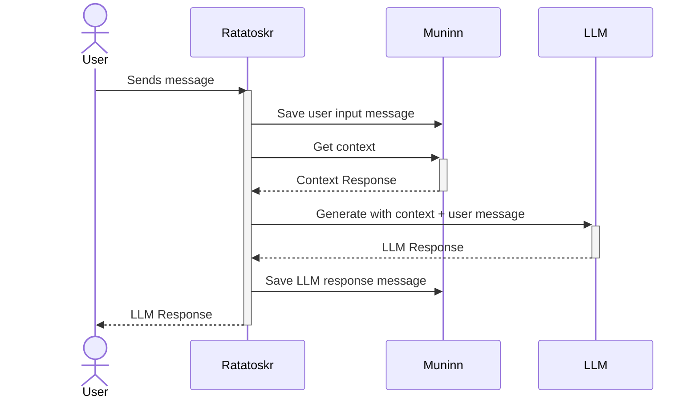

# Muninn

Muninn is a memory system designed to augment LLM powered chat bots with
advanced RAG based memory retrieval. It is designed to be a drop in service for
any chat bot that uses a OpenAI compatible API.


The system deals with messages in a specific model format compatible with OpenAI
APIs. The model format is as follows:

```json
{
    role: "user",
    message: "Hello, how are you?"
}
```

There are two important endpoints in the Muninn API:

Save message: This endpoint is used to save messages from the user, the llm or
even system messages, which can be used for extra context.

Get context: This endpoint is used to get the context for the current message
and is the main magic sauce of the Muninn system. It uses the saved messages to
generate a context by automating prompt engineering. It makes use of the
messages saved in the system to generate a context for the current message using
smart processes like semantic similarity and other NLP techniques.


## To build the docker file

```sh
docker build -t muninn .
```

## To run the docker file

Remember to pass in the environment variables for the API keys

```sh
docker run -e OPENAI_API_KEY=$OPENAI_API_KEY -p 8080:8080 muninn
```
